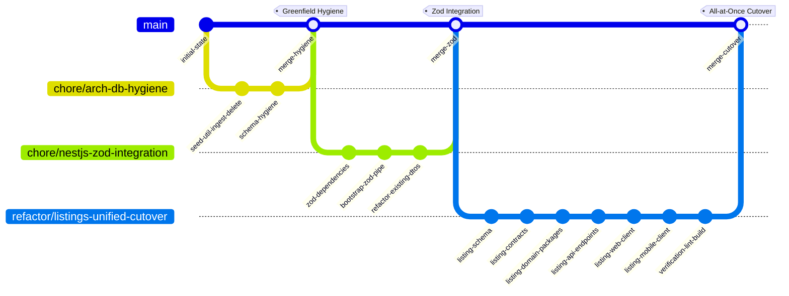

# Unified Listing Redesign & Staged Implementation Plan (2026-07-04)

> **For agentic workers:** REQUIRED SUB-SKILL: Use superpowers:subagent-driven-development (recommended) or superpowers:executing-plans to implement this plan task-by-task. Steps use checkbox (`- [ ]`) syntax for tracking.

**Goal:** Refactor the database schema, API contracts, shared domain packages, and both client applications (Next.js web and Expo mobile) from separate `Collection`/`Series`/`Lecture` entities into a unified `Listing` model. Deconstruct and remove the file-based CLI ingestion pipeline (`packages/util-ingest`) completely in favor of standard Prisma seeders.

---

## Git Branch & PR Rollout Strategy

To achieve a clean **all-at-once cutover** without causing continuous integration (CI) build failures on the `main` branch, the implementation stages are grouped into exactly **three development branches**:



### Branch 1: `chore/arch-db-hygiene`

- **Stages Covered:** Stage 1 (Pre-Migration Schema Hygiene & Seeding).
- **Rationale:** Safe, non-breaking database optimizations. This deletes the legacy `util-ingest` pipeline but keeps client applications, APIs, and domain packages compiling against the old tables (since the seeder populates them). It is low-risk and can be merged to `main` immediately.

### Branch 2: `chore/nestjs-zod-integration`

- **Stages Covered:** Stage 2 (NestJS Zod Integration).
- **Rationale:** Integrating `nestjs-zod` globally on the backend, moving DTO schemas to `@sd/core-contracts`, and migrating existing controllers and DTOs (Auth, Account, Livestream, etc.) to use the Zod hybrid DTO pattern. Running this in its own branch isolates validation modernization risk and sets up the Zod DTO helpers for the subsequent Listing model work.

### Branch 3: `refactor/listings-unified-cutover`

- **Stages Covered:** Stage 3 to Stage 9 (Schema Unification, Contracts, Domain Packages, Backend, Web client, Mobile client, Throttler fine-tuning).
- **Rationale:** Because this is an all-at-once migration, updating only the database or API in separate branches would break the compilation of client apps in CI (`bun run typecheck` / `turbo run build`). Therefore, all refactoring tasks for contracts, domain packages, and client-side page/player views must be executed and verified on this single, coordinated branch before a single pull request merges it to `main`.

---

## Branch 1: `chore/arch-db-hygiene`

### Stage 1: Pre-Migration Schema Hygiene & Seeding

**Goal:** Clean up the surviving models in the database, write a temporary seeder for verification, and delete the legacy `util-ingest` package.

#### Files:

- Modify: `packages/core-db/prisma/schema.prisma`
- Create: `packages/core-db/prisma/seed.ts` (temporary legacy schema version)
- Delete: `packages/util-ingest/` (delete directory completely)
- Modify: `package.json` (remove `ingest:content` and `ingest:remove` scripts)
- Test: `packages/core-db/src/index.spec.ts`

#### Changes:

- **Temporary Seeder:** Write `packages/core-db/prisma/seed.ts` using the Prisma Client to insert mock scholars, collections, series, and lectures matching the **current** schema. Add `"prisma": { "seed": "bun run prisma/seed.ts" }` in `packages/core-db/package.json`.
- **Pre-Migration Data Cleanup (User.role):** Execute a raw SQL query `UPDATE "User" SET "role" = 'user' WHERE "role" NOT IN ('user', 'admin', 'editor', 'superadmin');` to clean up custom developer data before converting the column to an enum.
- **User.role → enum:** Create `enum UserRole { user admin editor superadmin }` and change `role String @default("user")` to `role UserRole @default(user)`. Update NestJS permissions checks/guards.
- **User.banned → non-nullable:** Change `banned Boolean?` to `banned Boolean @default(false)`.
- **Topic.parentId Cascade:** Set `onDelete: Cascade` on `Topic.parentId`.
- **Scholar.updatedAt fix:** Standardize to `updatedAt DateTime @updatedAt`.
- _(Note: Do NOT refactor the clickstream `AnalyticsEvent` table's createdAt field here. It is dropped completely in Stage 2)._

#### Test Strategy:

- Seed Verification:
  - Command: `bun run --filter @sd/core-db prisma:seed`
  - Assertions: Verify database has records in `Lecture` and `Series` tables.
- Schema Verification:
  - Command: `bun run --filter @sd/core-db test`
  - Assertions: Verify `UserRole` enum and non-nullable `User.banned` constraints.

* [ ] **Step 1.1: Write temporary database seeder targeting the old schema**
* [ ] **Step 1.2: Run seeder command to verify database successfully populates**
* [ ] **Step 1.3: Apply pre-migration schema hygiene in `schema.prisma` and delete `packages/util-ingest`**
* [ ] **Step 1.4: Run core-db test suite to verify compiles and passes**

---

## Branch 2: `chore/nestjs-zod-integration`

### Stage 2: NestJS Zod Integration

**Goal:** Establish `nestjs-zod` as the universal validation pipeline. Move core validation schemas to `@sd/core-contracts` and refactor ALL existing backend DTOs to the Zod hybrid DTO pattern.

#### Files:

- Modify: `packages/core-contracts/package.json` (add `zod` dependency)
- Create/Modify: `packages/core-contracts/src/types/`
  - Convert: `packages/core-contracts/src/types/scholar.types.ts` (write Zod schemas and infer DTO types)
  - Convert: `packages/core-contracts/src/types/feed.types.ts` (write Zod schemas and infer DTO types)
  - Convert: `packages/core-contracts/src/types/home.types.ts` (write Zod schemas and infer DTO types)
  - Convert: `packages/core-contracts/src/types/library.types.ts` (write Zod schemas and infer DTO types)
  - Convert: `packages/core-contracts/src/types/search.types.ts` (write Zod schemas and infer DTO types)
  - Convert: `packages/core-contracts/src/types/admin.types.ts` (write Zod schemas and infer DTO types)
- Create: `packages/core-contracts/src/schema/` (add Zod validator schemas for Auth, Account, and Livestream)
- Modify: `apps/api/package.json` (add `nestjs-zod`, remove `class-validator` and `class-transformer`)
- Modify: `apps/api/src/main.ts` (replace global `ValidationPipe` with `ZodValidationPipe`)
- Modify: `apps/api/src/modules/*/dto/` (refactor existing input DTO files to extend `createZodDto`)
- Test: `apps/api/src/modules/auth/auth.controller.spec.ts`

#### Changes:

- **Comprehensive Contract Migration:** Re-write 100% of TypeScript interfaces inside `packages/core-contracts/src/types/` to declare Zod validation schemas instead. Use Zod type inference `z.infer<typeof schema>` to export TypeScript types, guaranteeing validation metadata and types remain in lockstep.
- **Global Validation Bootstrap:** Update `apps/api/src/main.ts` to register `ZodValidationPipe` globally:
  ```typescript
  import { ZodValidationPipe } from "nestjs-zod";
  app.useGlobalPipes(new ZodValidationPipe());
  ```
- **DTO Migrations:** Replace legacy class-validator classes with schemas in `@sd/core-contracts` and wrap them in classes:

  ```typescript
  import { createZodDto } from "nestjs-zod";
  import { loginSchema } from "@sd/core-contracts";

  export class LoginDto extends createZodDto(loginSchema) {}
  ```

- Refactor DTOs in:
  - `apps/api/src/modules/auth/`
  - `apps/api/src/modules/account/`
  - `apps/api/src/modules/scholars/`
  - `apps/api/src/modules/live/`

#### Test Strategy:

- Bootstrap Verify:
  - Command: `bun run --filter @sd/core-contracts build` and `bun run --filter api build`
  - Assertions: Verify compilation succeeds with new NestJS validation pipes and Zod DTO contracts.
- Run API Test Suites:
  - Command: `bun run --filter api test`
  - Assertions: Assert that input validation constraints return clean Zod error schemas (400 Bad Request) on schema violations.

* [ ] **Step 2.1: Add zod dependencies to contracts and nestjs-zod to the API project**
* [ ] **Step 2.2: Register global ZodValidationPipe in API bootloader `main.ts`**
* [ ] **Step 2.3: Re-write 100% of existing contracts inside packages/core-contracts/src/types/ to use Zod-inferred schemas**
* [ ] **Step 2.4: Define Zod schemas inside contracts and refactor existing Auth/Account/Scholars DTO classes**
* [ ] **Step 2.5: Execute API compile builds and verify existing validation test suites pass**

---

## Branch 3: `refactor/listings-unified-cutover`

### Stage 3: Prisma Schema Listing Unification

**Goal:** Replace legacy collection/series/lecture tables with the new self-referencing hierarchical `Listing` model. Update the seeder script in the same commit.

#### Files:

- Modify: `packages/core-db/prisma/schema.prisma`
- Modify: `packages/core-db/prisma/seed.ts` (updated to Listings schema)
- Test: `packages/core-db/src/index.spec.ts`

#### Changes:

- **Prisma Datasource Configuration:** Enable `postgresqlExtensions` preview features to configure `pg_trgm` natively:

  ```prisma
  // packages/core-db/prisma/schema.prisma
  datasource db {
    provider   = "postgresql"
    url        = env("DATABASE_URL")
    extensions = [pg_trgm]
  }

  generator client {
    provider        = "prisma-client-js"
    output          = "../src/generated/prisma"
    moduleFormat    = "cjs"
    previewFeatures = ["postgresqlExtensions"]
  }
  ```

- **Listing Model:** Create the `Listing` model. Enforce globally unique slugs via `slug String @unique`. Denormalize default language titles by storing `title String` and `description String?` on the base table. Use `ListingTranslation` only for secondary localizations.
- **Audit Columns:** Define `createdBy String? @db.Uuid`, `updatedBy String? @db.Uuid`, and `deletedBy String? @db.Uuid` on the `Listing` and `Scholar` models as decoupled fields without strict foreign keys.
- **Hierarchical Restrict:** Set recursive parent-child relations with a composite key constraint `(parentId, scholarId) -> Listing(id, scholarId)`. Set `onDelete: Restrict` on the parent Listing relationship.
- **User Cascade Relations:** Change `onDelete: Restrict` on user relations inside progress/favorites tables to `onDelete: Cascade`. This enables user account hard-deletions to clean up associated progress logs automatically:
  - `FavoriteListing`: `user User @relation(fields: [userId], references: [id], onDelete: Cascade)`
  - `UserListingProgress`: `user User @relation(fields: [userId], references: [id], onDelete: Cascade)`
- **CurationMetadata Model:** Define the curation metadata model explicitly:
  ```prisma
  model CurationMetadata {
    id         String                   @id @default(dbgenerated("gen_random_uuid()")) @db.Uuid
    listingId  String                   @unique @db.Uuid
    override   Boolean                  @default(false)
    startAt    DateTime?
    endAt      DateTime?
    recurrence RecommendationRecurrence @default(none)
    listing    Listing                  @relation(fields: [listingId], references: [id], onDelete: Cascade)
  }
  ```
- **Joins & Dependencies:** Add `ListingTranslation`, `ListingTopic`.
- **AudioAsset Refactor:** Update `lectureId String` to `listingId String @db.Uuid` and change references to `Listing`.
- **Relations Clean Up:**
  - `RecommendationHero`: Remove `entityKind` and `entityId` strings, adding `listingId String @db.Uuid` FK pointing to `Listing` with `onDelete: Cascade`.
  - `FavoriteListing` (replaces `FavoriteLecture`): Add `listingId String @db.Uuid` FK.
  - `UserListingProgress` (replaces `UserLectureProgress`): Add `listingId String @db.Uuid` FK.
- **Trigram Search GIN Index:** Add the GIN search index on Listing `title`:
  ```prisma
  @@index([title(ops: raw("gin_trgm_ops"))], type: Gin)
  ```
- **Delete Tables:** Delete `Collection`, `Series`, `Lecture` tables, and `AnalyticsEvent` clickstream table completely.
- **Rewrite Seeder:** Update `prisma/seed.ts` to write mock data directly to `Listing`, `ListingTranslation`, and `ListingTopic` models.

#### Test Strategy:

- Setup Test Database environment variables:
  - Command: `cross-env DATABASE_URL=postgres://localhost/salafi_test bun run --filter api test`
- Introspection & Generate:
  - Command: `bun run --filter @sd/core-db prisma:generate`
  - Assertions: Verify client builds successfully.
- Run New Database Seeder:
  - Command: `bun run --filter @sd/core-db prisma:seed`
  - Assertions: Verify database has records populated in the `Listing` table.
- Modify: `packages/core-db/src/index.spec.ts`
  - Assertions: Verify Listing GIN trigram searches, cascade deletes, and uniqueness constraints.
  - Command: `bun run --filter @sd/core-db test`

* [ ] **Step 3.1: Enable postgresqlExtensions preview and define pg_trgm provider settings**
* [ ] **Step 3.2: Implement Listing, CurationMetadata, and translations schemas in `schema.prisma`**
* [ ] **Step 3.3: Refactor AudioAsset, RecommendationHero, Favoriting, and Progress relations with user delete cascades**
* [ ] **Step 3.4: Rewrite Prisma database seeder `seed.ts` to use Listing models**
* [ ] **Step 3.5: Execute Prisma generate, migrations, seeder, and run core-db tests**

---

### Stage 4: Core Contracts Reorganization

**Goal:** Align all public and administrative API contracts under the unified `Listing` Zod structures.

#### Files:

- Create: `packages/core-contracts/src/types/listing.types.ts` (defined as Zod schema + z.infer type)
- Delete: `packages/core-contracts/src/types/lecture.types.ts`
- Delete: `packages/core-contracts/src/types/series.types.ts`
- Delete: `packages/core-contracts/src/types/collection.types.ts`
- Modify: `packages/core-contracts/src/endpoints.ts`
- Modify: `packages/core-contracts/src/query/index.ts`
- Test: `packages/core-contracts/src/endpoints.spec.ts`

#### Changes:

- **DTOs:** Define Zod schemas and type-infer `ListingViewDto` (detail), `ListingChildDto` (nested nodes), and `ListingItemDto` (feed list). Add `title` and `description` as required string fields.
- **Endpoints:** Collapse routes into `/listings` and `/admin/listings`. Public details resolves by slug name: `/listings/:slug`. Define nested user permissions endpoints `/admin/users/:userId/permissions`.
- **Query Keys:** Update cache query tags to use `queryKeys.listings` and `queryKeys.admin.listings`.

#### Test Strategy:

- Modify: `packages/core-contracts/src/endpoints.spec.ts`
  - Assertions: Test formatting functions for public details and admin listings endpoints.
  - Command: `bun run --filter @sd/core-contracts test`

* [ ] **Step 4.1: Define Listing DTO variants in `listing.types.ts` as Zod-inferred types**
* [ ] **Step 4.2: Map listings endpoints and update cache query keys**
* [ ] **Step 4.3: Delete legacy types files and verify compile build succeeds**

---

### Stage 5: Domain Packages Migration

**Goal:** Refactor the shared packages `@sd/domain-content` and `@sd/domain-audio` to use the new DTO contracts, query keys, and listings state stores.

#### Files:

- Modify: `packages/domain-content/src/`
  - Rename: `lecture.api.ts` -> `listings.api.ts` (expose `useListingDetail` using unique slug key instead of UUID)
  - Modify: `scholar.api.ts` (update scholar content list mapping and split functions)
  - Modify: `feed.api.ts` (map returned items to unified `ListingItemDto` array)
  - Modify: `library.api.ts` (adjust query params and endpoints)
  - Modify: `library.local.ts` (refactor SQLite database outbox sync queries)
  - Modify: `translations.api.ts` (refactor to listings endpoints)
- Modify: `packages/domain-audio/src/`
  - Modify: `index.ts` (adjust exports)
  - Modify: `types/track.types.ts` (rename `lectureId` properties to `listingId`)
  - Modify: `types/state.types.ts` (map status codes)
  - Modify: `store/playback.store.ts` (adjust track loading actions)
  - Modify: `service/audio.service.ts` (resolving source URLs)
  - Modify: `progress/progress.store.ts` (rename `LectureProgress` to `ListingProgress`, updating Zustand keys)
  - Modify: `progress/progress.sync.ts` (modify offline SQLite synchronization payloads and local progress outbox sync parameters to map listing parameters)
  - Rename: `hooks/use-lecture-progress.ts` -> `hooks/use-listing-progress.ts`

#### Changes:

- **domain-content:** Update content fetching hooks (e.g. `useScholars`, `useFeed`) to query Listings.
- **domain-audio:** Update player stores, audio asset queue engines, progress caching triggers, and database syncing modules to use `listingId` instead of `lectureId`. Both Next.js web and Expo mobile clients resolve queries via unique `slug` lookup keys.

#### Test Strategy:

- Run typecheck:
  - Command: `bun run typecheck --filter @sd/domain-content --filter @sd/domain-audio`
  - Assertions: Confirm packages build cleanly with 0 type errors.

* [ ] **Step 5.1: Refactor domain-content hooks and queries to use listings DTOs**
* [ ] **Step 5.2: Update domain-audio player resolver mapping models and progress stores**
* [ ] **Step 5.3: Update progress cache hooks, rename hook files, and verify domain packages compile**

---

### Stage 6: Backend Services & REST Controllers

**Goal:** Clean up the monolithic `ScholarsService` CRUD, implement the listings API module, write new REST routes, standardize user permission payloads, and implement hard user deletion endpoints.

#### Files:

- Create: `apps/api/src/modules/listings/` (repo, service, controllers)
- Modify: `apps/api/src/app.module.ts`
- Modify: `apps/api/src/modules/scholars/scholars.controller.ts`
- Modify: `apps/api/src/modules/scholars/scholars.service.ts`
- Modify: `apps/api/src/modules/scholars/scholars.repo.ts`
- Modify: `apps/api/src/modules/admin-permissions/admin-permissions.controller.ts`
- Modify: `apps/api/src/modules/admin-permissions/admin-permissions.service.ts`
- Modify: `apps/api/src/modules/account/account.controller.ts`
- Modify: `apps/api/src/modules/account/account.service.ts`
- Delete:
  - `apps/api/src/modules/scholars/admin-collections.controller.ts`
  - `apps/api/src/modules/scholars/admin-series.controller.ts`
  - `apps/api/src/modules/scholars/collection-translations.controller.ts`
  - `apps/api/src/modules/scholars/series-translations.controller.ts`
  - `apps/api/src/modules/scholars/collection-translation.integration.spec.ts`
  - `apps/api/src/modules/scholars/series-translation.integration.spec.ts`
  - `apps/api/src/modules/lectures/` (entire directory)
  - `apps/api/src/modules/listing/` (entire directory, old format resolver)
- Test: `apps/api/src/modules/listings/listings.service.spec.ts`
- Test: `apps/api/src/modules/listings/listings.repo.spec.ts`
- Test: `apps/api/src/modules/listings/listings.controller.spec.ts`
- Test: `apps/api/src/modules/account/account.controller.spec.ts`

#### Changes:

- **Decompose Scholars:** Remove series, collections, and translations CRUD operations from `ScholarsService` and `scholars.repo.ts`, limiting the scholar module strictly to bio profiles and kibar details.
- **Listings Repository:** Create `listings.repo.ts` querying the unified `Listing` schema.
- **Denormalized Counter Sync Hook:** Implement `recalculateParentAggregates(tx, parentId: string)` in `listings.repo.ts`. Inside a Prisma transaction, this helper computes aggregates for published children and updates `publishedLectureCount` and `publishedDurationSeconds` columns on the parent record.
- **Listings Service:** Create `listings.service.ts` performing localized fallback checks and mapping fields (reads `title`/`description` directly from base table for default locale, avoiding JOIN operations).
- **Listings Controllers:** Create public `listings.controller.ts` exposing `GET /listings/:slug` and `admin-listings.controller.ts` for admin operations.
- **Permissions Routes Refactor:** Update `admin-permissions.controller.ts` and service classes to unify return shapes as a clean string array (`string[]`). Mount endpoints under `/admin/users/:userId/permissions`.
- **User Hard-Deletion Endpoints:**
  - In `account.controller.ts`, implement `DELETE /account` that deletes the authenticated caller's record: `prisma.user.delete({ where: { id: req.user.id } })`.
  - Implement admin endpoint `DELETE /admin/users/:userId` for administrative hard-deletion of user accounts.
  - When executing `prisma.user.delete`, verify that cascade deletes wipe associated progress and favorite records, but decoupled audit fields on `Listing` and `Scholar` prevent these public catalog tables from deleting.

#### Test Strategy:

- Run DB Seed and Migrations on test database:
  - Command: `cross-env DATABASE_URL=postgres://localhost/salafi_test bun run --filter api test`
- Create: `listings.service.spec.ts` and `account.controller.spec.ts`
  - Assertions: Verify transactional aggregate counter sync when listing states change. Assert that deleting a user record cascade-deletes their progress history and favorites, but leaves the unified listings and scholars tables completely untouched.
  - Command: `bun run --filter api test`

* [ ] **Step 6.1: Clean up Scholars god-class files and delete deprecated admin-controllers**
* [ ] **Step 6.2: Create Listings module, repository, and service classes**
* [ ] **Step 6.3: Implement transactional aggregate counter sync hooks in repository**
* [ ] **Step 6.4: Implement administrative and public Listings controllers**
* [ ] **Step 6.5: Implement user account hard-deletion routes and services**
* [ ] **Step 6.6: Update permissions routing under users sub-resource controller and standardize return DTOs**
* [ ] **Step 6.7: Remove legacy lectures/series/collections directories and register new modules**
* [ ] **Step 6.8: Verify all NestJS unit and integration tests pass**

---

## Stage 7: Web Frontend Cutover

**Goal:** Refactor Next.js client-side views, Zod form validation handlers, and API hooks to use the new `/listings` models.

#### Files:

- Modify: `apps/web/src/features/`
- Rename: `apps/web/src/app/(main)/listing/[id]` -> `apps/web/src/app/(main)/listings/[slug]`
- Modify: `apps/web/src/app/(main)/listings/[slug]/page.tsx`
- Delete: `apps/web/src/app/(main)/lectures/`
- Delete: `apps/web/src/app/(main)/series/`
- Delete: `apps/web/src/app/(main)/collections/`
- Test: `apps/web/src/routes.spec.ts`

#### Changes:

- **Routes:** Rename paths to `/listings/[slug]`. Inside `page.tsx` extract `slug` from route parameters and fetch listing.
- **Layout Dispatch:** In `ListingDetailScreen`, inspect the resolved `listing.format` to render the appropriate collection grid, series stack, or single track player view.
- **Client-Side Form validation:** Integrate shared Zod validation schemas imported from `@sd/core-contracts` inside frontend form controllers (e.g. login, curate metadata, profile bio settings) via `react-hook-form` + `@hookform/resolvers/zod` to prevent invalid payload dispatches.
- **Query Hooks:** Update catalog, search, and library queries to consume Listings.
- **Admin Views:** Update content curation lists to reference `AdminListingListItemDto`.

#### Test Strategy:

- Modify: `apps/web/src/routes.spec.ts`
  - Assertions: Assert that Next.js loaders and routing guards correctly resolve listing endpoints.
  - Command: `bun run --filter web typecheck` and `bun run --filter web test`

* [ ] **Step 7.1: Rename route folders and update next.js dynamic parameters**
* [ ] **Step 7.2: Integrate Zod schemas for client-side forms and metadata curation screens**
* [ ] **Step 7.3: Implement format-discriminator details screen and delete legacy views**
* [ ] **Step 7.4: Update admin dashboards and verify typecheck builds cleanly**

---

## Stage 8: Mobile Frontend Cutover

**Goal:** Refactor Expo client playback states, SQLite offline caching, local Zod schema inputs, and catalog views to listings DTOs.

> [!NOTE]
> The mobile client cutover depends strictly on Stage 4 (Domain Packages) being fully completed and compile-verified.

#### Files:

- Modify: `apps/native/src/features/`
- Delete:
  - `apps/native/src/app/(content)/lectures`
  - `apps/native/src/app/(content)/series`
  - `apps/native/src/app/(content)/collections`
- Create: `apps/native/src/app/(content)/listings/[slug].tsx`
- Test: `apps/native/src/features/downloads/engine/download.spec.ts`

#### Changes:

- **Routes:** Route details screen by slug via `listings/[slug]`. Extract the parameter and dispatch rendering.
- **Zod Data Ingestion:** Import Zod schemas from `@sd/core-contracts` inside local synchronization services to parse and validate incoming JSON payloads before inserting them into SQLite/WatermelonDB, protecting local store schema boundaries.
- **Player Store:** Refactor `domain-playback` and `domain-progress` Zustand stores to save progress using `listingId`.
- **Offline Sync:** Update local SQLite/WatermelonDB outbox sync schemas and outbound payloads to send unified progress formats.
- **Catalog Screens:** Implement scholar listing details and listing detail routes using format-dispatched rendering.

#### Test Strategy:

- Run typecheck: `bun run --filter native typecheck`
- Run tests: `bun run --filter native test`

* [ ] **Step 8.1: Delete legacy native routes and add unified Listings route page**
* [ ] **Step 8.2: Integrate shared Zod validation checks inside synchronization loaders and mobile forms**
* [ ] **Step 8.3: Update native player Zustand stores to map listing properties**
* [ ] **Step 8.4: Run offline sync test routines and map progress outbox payloads**
* [ ] **Step 8.5: Implement listings catalog screens and verify native build compiles**

---

## Stage 9: Throttling, Pagination & Verification

**Goal:** Configure rate limiters, apply standard pagination limits, and perform final monorepo verification.

#### Files:

- Modify: `packages/core-contracts/src/types/pagination.types.ts`
- Modify: `apps/api/src/app.module.ts` (configure throttler defaults)
- Modify: all NestJS public controllers (remove `@SkipThrottle()`)

#### Changes:

- **Throttler Verification:** Check `apps/api/src/app.module.ts` for default ThrottlerModule configurations. If missing or undefined, import and configure ThrottlerModule defaults:
  ```typescript
  ThrottlerModule.forRoot([
    {
      ttl: 60000,
      limit: 60,
    },
  ]);
  ```
  Once verified/configured, systematically remove `@SkipThrottle()` from all public catalog, scholars, and search controllers, retaining it only on health-checks and auth endpoints.
- **Pagination:** Implement standard `PaginatedResponse<T>` type and integrate `skip`/`take` limits on lists queries.

#### Test Strategy:

- Run typecheck: `bun run typecheck`
- Run all tests: `bun run test`
- Run linter: `bun run lint`
- Run build verification: `bun run build`

* [ ] **Step 9.1: Verify ThrottlerModule configurations in app.module.ts and remove SkipThrottle decorators**
* [ ] **Step 9.2: Apply pagination limits to search, feed, and library controllers**
* [ ] **Step 9.3: Run full monorepo typecheck, linting, and production builds**
