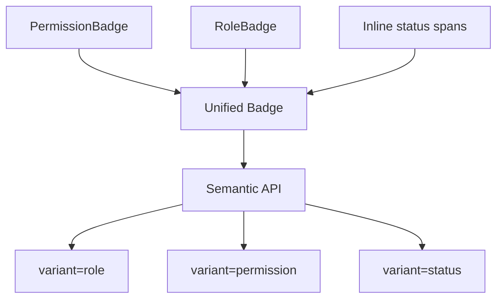
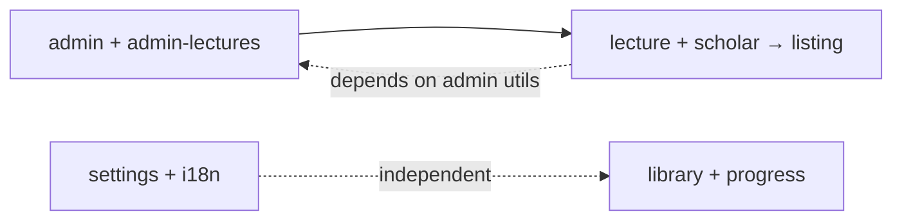

# Refactor apps/web Feature Organization

**Type:** refactor
**Created:** 2026-07-06
**Status:** Ready for implementation

---

## Summary

Consolidate four overlapping feature pairs in `apps/web` and eliminate inline style divergence from design tokens. Extract a unified Badge component and shared admin UI patterns, apply design token migrations across admin/listing/settings/library features, then merge related features into cohesive vertical slices. This resolves code duplication in admin components and ensures design token changes cascade automatically to all UI elements.

---

## Problem Frame

The `apps/web/src/features/` directory has four structural problems:

1. **Feature fragmentation**: Related functionality split across silos (admin + admin-lectures, lecture + scholar, settings + i18n, library + progress)
2. **Duplication**: PermissionBadge and RoleBadge implement the same badge pattern; admin screens repeat layout logic
3. **Token divergence**: Inline styles in admin screens use hardcoded values (`maxWidth: 1100`, `fontSize: 28`, colors `#e0e0e0`) instead of design token CSS variables, so token updates don't cascade
4. **Import complexity**: Feature boundaries create unnecessary import chains

The maintainability cost: changing a design token (e.g., `--surface-subtle`) updates compliant components but misses hardcoded values, creating visual inconsistency.

---

## Requirements

**R1. Feature consolidation**: Merge admin+admin-lectures → admin, lecture+scholar → listing, settings+i18n → settings, library+progress → library

**R2. Badge unification**: Replace PermissionBadge, RoleBadge, and inline status badges with a single polymorphic `<Badge>` component in `apps/web/src/shared/components/Badge/`

**R3. Token compliance**: Replace all inline styles in admin, listing, settings, library features with CSS Modules referencing design token variables (`var(--surface-*)`, `var(--space-*)`, `var(--typo-*)`)

**R4. Shared admin patterns**: Extract AdminLayout, AdminTable, AdminForm to `apps/web/src/shared/components/` when patterns are reused across admin screens (per YAGNI: extract only if 2+ consumers exist)

**R5. Build integrity**: TypeScript builds cleanly, routes resolve correctly after merges, shared components are imported (not duplicated)

---

## Success Criteria

- Zero inline styles remain in merged features (admin, listing, settings, library)
- `pnpm build` succeeds in `apps/web` with no TypeScript errors
- All routes work with correct component imports
- Shared components (Badge, AdminLayout, AdminTable, AdminForm) are actually imported from `shared/`, not copy-pasted

---

## Key Technical Decisions

**KTD1. Hybrid approach: Badge + tokens first, then merges**
Extract Badge component and migrate all four features to design tokens before feature merges. This isolates token migration risk from import chain restructuring. If token migration reveals blockers, feature merges can pause without coupling.

**KTD2. Staged migration (one feature merge per PR)**
Each feature merge is a separate PR in dependency order. Dependencies:

- Listing depends on admin (scholar references may need admin utilities)
- Settings and library are independent

This allows incremental review and rollback if import chains break.

**KTD3. Anticipate reuse for admin components**
Move AdminLayout, AdminTable, AdminForm to `shared/` even if only admin uses them now. The precedent from Listing Unification (Stage 7) shows admin UI patterns stabilize into reusable abstractions. Extracting early avoids a second refactor when the next feature needs them.

**KTD4. Semantic Badge API**

```tsx
<Badge variant="role" role="admin" icon={<Shield />} />
<Badge variant="permission" permission="create:content" />
<Badge variant="status" status="active" />
```

Semantic variants (role, permission, status) eliminate per-use-case badge files while keeping type safety.

---

## Scope Boundaries

**In scope:**

- Badge extraction and unification
- Token migration for admin, listing (lecture + scholar), settings, library features
- Feature merges: admin+admin-lectures, lecture+scholar→listing, settings+i18n, library+progress
- Extraction of AdminLayout, AdminTable, AdminForm to `shared/`
- Test coverage for admin badge patterns, admin table layouts, and token variable usage

**Deferred to follow-up work:**

- Token migration for search, feed, live, support, auth features (not in scope per user confirmation)
- Responsive behavior changes beyond what token variables naturally provide
- Performance optimizations

**Outside scope:**

- Design token value changes (tokens exist; this refactor uses them, doesn't redefine them)
- Mobile-specific layout adjustments beyond existing desktop/mobile screen pairs

---

## High-Level Technical Design

### Badge Consolidation Flow



### Feature Merge Dependencies



### Token Migration Touch Points (per feature)

- Desktop screen `.tsx` files: Replace inline style objects with CSS Module classes
- Mobile screen `.tsx` files: Same pattern
- Component `.module.css` files: Replace hardcoded values with `var(--token-name)`
- Verify token variables exist in `apps/web/src/app/globals.css`

---

## Implementation Units

### U1. Extract and unify Badge component

**Goal:** Create a single polymorphic Badge component in `apps/web/src/shared/components/Badge/` that replaces PermissionBadge, RoleBadge, and inline status badges.

**Requirements:** R2

**Dependencies:** None

**Files:**

- Create: `apps/web/src/shared/components/Badge/Badge.tsx`
- Create: `apps/web/src/shared/components/Badge/Badge.module.css`
- Create: `apps/web/src/shared/components/Badge/Badge.test.tsx`
- Create: `apps/web/src/shared/components/Badge/index.ts`
- Reference: `apps/web/src/features/admin/components/permission-badge/permission-badge.tsx` (pattern to abstract)
- Reference: `apps/web/src/features/admin/components/role-badge/role-badge.tsx` (pattern to abstract)

**Approach:**
Semantic variant API:

```tsx
type BadgeProps =
  | { variant: "permission"; permission: string; icon?: ReactNode }
  | { variant: "role"; role: "admin" | "user" }
  | { variant: "status"; status: string; color?: "primary" | "muted" | "success" | "warning" };
```

Badge.module.css applies design tokens for padding (`--space-scale-xs`), border-radius (`--radius-scale-sm`), typography (`--typo-xs-font-size`), and background/foreground colors per variant (`--surface-primary-subtle`, `--content-primary-strong` for admin role; `--surface-subtle`, `--content-muted` for user role).

**Patterns to follow:**

- PermissionBadge structure (inline-flex with icon + text)
- RoleBadge conditional styling (admin vs user classes)
- Design token usage from grounding dossier:1:100

**Test scenarios:**

1. Renders permission badge with icon and text
2. Renders admin role badge with primary styling
3. Renders user role badge with muted styling
4. Renders status badge with custom color variant
5. Renders without icon when not provided

**Verification:** Import `<Badge variant="role" role="admin" />` in a test file; verify TypeScript infers correct props and component renders with design token CSS classes.

---

### U2. Apply token migration to admin feature

**Goal:** Replace all inline styles in admin feature screens and components with CSS Modules using design token variables.

**Requirements:** R3

**Dependencies:** U1 (Badge component must exist for badge replacements)

**Files:**

- Modify: `apps/web/src/features/admin/screens/admin-scholars/admin-scholars.screen.desktop.tsx`
- Modify: `apps/web/src/features/admin/screens/admin-scholars/admin-scholars.screen.desktop.module.css`
- Modify: `apps/web/src/features/admin/screens/admin-users/admin-users.screen.desktop.tsx`
- Modify: `apps/web/src/features/admin/screens/admin-users/admin-users.screen.desktop.module.css`
- Modify: `apps/web/src/features/admin/screens/admin-dashboard/admin-dashboard.screen.desktop.tsx`
- Modify: `apps/web/src/features/admin/screens/admin-dashboard/admin-dashboard.screen.desktop.module.css`
- Modify: (all remaining admin screens following same pattern)
- Modify: `apps/web/src/features/admin/components/user-card/user-card.tsx`
- Modify: `apps/web/src/features/admin/components/user-card/user-card.module.css`
- Test: `apps/web/src/features/admin/screens/admin-scholars/admin-scholars.screen.test.tsx`

**Approach:**
For each admin screen with inline styles:

1. Identify hardcoded values (maxWidth, fontSize, colors, spacing)
2. Add corresponding CSS Module classes in `.module.css`
3. Replace hardcoded values with design token variables:
   - Spacing: `var(--space-layout-page-x)`, `var(--space-layout-page-y)`, `var(--space-layout-section-y)`
   - Typography: `var(--typo-display-lg-font-size)`, `var(--typo-title-lg-font-size)`
   - Colors: `var(--surface-default)`, `var(--content-primary)`, `var(--border-default)`
   - Radius: `var(--radius-component-panel)`
4. Replace PermissionBadge and RoleBadge imports with unified Badge
5. Update badge usages to semantic variant API

**Patterns to follow:**

- Search home screen token usage (grounding dossier reference)
- Badge component design token CSS from U1

**Test scenarios:**

1. Admin scholars screen renders without inline styles
2. Admin users screen applies `--space-layout-page-x` for horizontal padding
3. Admin dashboard uses `--typo-display-lg-font-size` for heading typography
4. User card component renders Badge with permission variant
5. User row component renders Badge with role variant
6. Covers admin table layout with token-based spacing

**Verification:** Run `grep -r "style={{" apps/web/src/features/admin/` and verify zero matches. Check that `pnpm build` succeeds and admin routes render correctly.

---

### U3. Apply token migration to listing feature (lecture + scholar)

**Goal:** Replace inline styles in lecture and scholar features with design token CSS variables.

**Requirements:** R3

**Dependencies:** U1

**Files:**

- Modify: `apps/web/src/features/lecture/screens/lecture-detail/lecture-detail.screen.desktop.tsx`
- Modify: `apps/web/src/features/lecture/screens/lecture-detail/lecture-detail.screen.desktop.module.css`
- Modify: `apps/web/src/features/lecture/components/lecture-meta/lecture-meta.tsx`
- Modify: `apps/web/src/features/lecture/components/lecture-meta/lecture-meta.module.css`
- Modify: `apps/web/src/features/scholar/` (screens and components following same pattern)
- Test: `apps/web/src/features/lecture/components/lecture-meta/lecture-meta.test.tsx`

**Approach:**
Same pattern as U2, applied to lecture and scholar feature files. Focus on:

- Lecture detail screen layout spacing
- Lecture meta component typography and color tokens
- Scholar profile components (if they exist with inline styles)

**Patterns to follow:** U2 token migration pattern

**Test scenarios:**

1. Lecture detail screen uses `--space-layout-section-y` for vertical spacing
2. Lecture meta component applies `--typo-caption-font-size` for metadata text
3. Scholar components reference design tokens for profile styling
4. Covers lecture playback UI states with token-based colors

**Verification:** `grep -r "style={{" apps/web/src/features/lecture/ apps/web/src/features/scholar/` returns zero matches. Lecture detail route renders correctly.

---

### U4. Apply token migration to settings feature

**Goal:** Replace inline styles in settings feature with design token CSS variables.

**Requirements:** R3

**Dependencies:** U1

**Files:**

- Modify: `apps/web/src/features/settings/screens/account/account.screen.desktop.tsx`
- Modify: `apps/web/src/features/settings/screens/account/account.screen.desktop.module.css`
- Modify: `apps/web/src/features/settings/screens/account-profile/account-profile.screen.desktop.tsx`
- Modify: `apps/web/src/features/settings/screens/account-profile/account-profile.screen.desktop.module.css`
- Modify: (all remaining settings screens)
- Test: `apps/web/src/features/settings/screens/account/account.screen.test.tsx`

**Approach:**
Settings screens already use SettingsRow from `shared/`. Focus on:

- Container spacing and layout tokens
- Form control styling
- Section headers and dividers

**Patterns to follow:** U2 token migration pattern, SettingsRow component pattern (grounding dossier:1:119)

**Test scenarios:**

1. Account screen applies `--spacing-page-x` for container padding
2. Account profile screen uses `--radius-component-panel` for section borders
3. Settings general screen references `--content-muted` for sublabel text
4. Covers form input states with token-based border and focus colors

**Verification:** `grep -r "style={{" apps/web/src/features/settings/` returns zero matches. Settings routes render correctly.

---

### U5. Apply token migration to library feature

**Goal:** Replace inline styles in library feature with design token CSS variables.

**Requirements:** R3

**Dependencies:** U1

**Files:**

- Modify: `apps/web/src/features/library/` (screens and components)
- Test: `apps/web/src/features/library/screens/library-home/library-home.screen.test.tsx`

**Approach:**
Same pattern as U2-U4, applied to library feature files. Focus on:

- List item spacing
- Grid layouts for content cards
- Progress indicators

**Patterns to follow:** U2 token migration pattern

**Test scenarios:**

1. Library home screen uses `--space-layout-section-y` for list spacing
2. Library progress components apply `--surface-subtle` for background
3. Library content cards reference `--radius-component-chip` for rounded corners
4. Covers progress indicator states with token-based colors

**Verification:** `grep -r "style={{" apps/web/src/features/library/ apps/web/src/features/progress/` returns zero matches. Library routes render correctly.

---

### U6. Extract AdminLayout, AdminTable, AdminForm to shared/

**Goal:** Move reusable admin UI patterns to `apps/web/src/shared/components/` when 2+ admin screens use them.

**Requirements:** R4

**Dependencies:** U2 (admin feature token migration must complete first to identify stable patterns)

**Files:**

- Create: `apps/web/src/shared/components/AdminLayout/AdminLayout.tsx`
- Create: `apps/web/src/shared/components/AdminLayout/AdminLayout.module.css`
- Create: `apps/web/src/shared/components/AdminLayout/AdminLayout.test.tsx`
- Create: `apps/web/src/shared/components/AdminTable/AdminTable.tsx`
- Create: `apps/web/src/shared/components/AdminTable/AdminTable.module.css`
- Create: `apps/web/src/shared/components/AdminTable/AdminTable.test.tsx`
- Create: `apps/web/src/shared/components/AdminForm/AdminForm.tsx`
- Create: `apps/web/src/shared/components/AdminForm/AdminForm.module.css`
- Create: `apps/web/src/shared/components/AdminForm/AdminForm.test.tsx`
- Reference: `apps/web/src/features/admin/screens/admin-users/` (layout pattern)
- Reference: `apps/web/src/features/admin/components/user-card/` (card pattern)

**Execution note:** Only extract a component if 2+ admin screens currently use the pattern (YAGNI). If a pattern appears in only one screen, defer extraction.

**Approach:**

1. Audit admin screens for repeated layout, table, and form patterns
2. For each pattern used in 2+ places:
   - Extract to `shared/components/<ComponentName>/`
   - Preserve design token CSS from U2
   - Update admin screen imports to use shared component
3. AdminLayout: page header + breadcrumb + content container pattern
4. AdminTable: responsive table wrapper with sorting/filtering slots
5. AdminForm: form field layout with validation states

**Patterns to follow:** SettingsRow abstraction pattern (grounding dossier:1:119)

**Test scenarios:**

1. AdminLayout renders page header with breadcrumb
2. AdminLayout applies `--spacing-page-x` for container padding
3. AdminTable renders desktop table with sortable columns
4. AdminTable switches to card list on mobile breakpoint
5. AdminForm renders field rows with label/control layout
6. AdminForm displays validation errors with `--content-critical` color
7. Covers admin layout responsive behavior with token-based breakpoints

**Verification:** At least 2 admin screens import each shared component. Verify `pnpm build` succeeds and admin routes still render correctly.

---

### U7. Merge admin + admin-lectures → admin

**Goal:** Consolidate admin and admin-lectures features into a single admin feature vertical slice.

**Requirements:** R1, R5

**Dependencies:** U2, U6 (token migration and shared component extraction must complete first)

**Files:**

- Move: `apps/web/src/features/admin-lectures/components/AudioUploader/` → `apps/web/src/features/admin/components/`
- Move: `apps/web/src/features/admin-lectures/components/LectureEditModal/` → `apps/web/src/features/admin/components/`
- Move: `apps/web/src/features/admin-lectures/screens/admin-lectures/` → `apps/web/src/features/admin/screens/`
- Move: `apps/web/src/features/admin-lectures/api/` → `apps/web/src/features/admin/api/`
- Delete: `apps/web/src/features/admin-lectures/` (folder)
- Modify: `apps/web/src/app/(main)/(admin)/admin/lectures/page.tsx` (update import paths)
- Test: `apps/web/src/features/admin/components/LectureEditModal/LectureEditModal.test.tsx`

**Approach:**

1. Move all admin-lectures content to admin feature structure
2. Update import paths in LectureEditModal and AudioUploader to reference admin feature
3. Update route file imports to point to new locations
4. Delete empty admin-lectures folder
5. Verify no circular imports between admin feature and shared admin components

**Patterns to follow:** Listing Unification Stage 7 web frontend migration pattern (grounding dossier:1:143)

**Test scenarios:**

1. Admin lectures route resolves to correct page component
2. LectureEditModal imports from admin feature, not admin-lectures
3. AudioUploader imports work after move
4. Admin API client functions resolve correctly
5. Covers admin lecture editor form submission with validation

**Verification:** `pnpm build` succeeds. Navigate to `/admin/lectures` and verify page renders. Check that `apps/web/src/features/admin-lectures/` folder no longer exists.

---

### U8. Merge lecture + scholar → listing

**Goal:** Consolidate lecture and scholar features into a unified listing feature.

**Requirements:** R1, R5

**Dependencies:** U3, U7 (token migration complete; admin merge complete in case scholar references admin utilities)

**Files:**

- Move: `apps/web/src/features/lecture/` → `apps/web/src/features/listing/lecture/`
- Move: `apps/web/src/features/scholar/` → `apps/web/src/features/listing/scholar/`
- Modify: `apps/web/src/app/(main)/(feed)/lectures/[id]/page.tsx` (update import paths)
- Modify: `apps/web/src/app/(main)/(feed)/scholars/[id]/page.tsx` (update import paths)
- Test: `apps/web/src/features/listing/lecture/screens/lecture-detail/lecture-detail.screen.test.tsx`
- Test: `apps/web/src/features/listing/scholar/screens/scholar-profile/scholar-profile.screen.test.tsx`

**Approach:**

1. Create `apps/web/src/features/listing/` folder
2. Move lecture and scholar folders into listing as subfolders
3. Update all import paths in route files
4. Verify cross-feature imports (e.g., scholar linking to lectures) work within listing scope
5. Check for import chain issues with admin feature

**Patterns to follow:** Listing Unification Stage 7 pattern (grounding dossier:1:143)

**Test scenarios:**

1. Lecture detail route resolves to listing/lecture screen
2. Scholar profile route resolves to listing/scholar screen
3. Lecture components import from listing feature, not standalone lecture feature
4. Scholar components import from listing feature
5. Covers scholar-to-lecture navigation links with correct import paths

**Verification:** `pnpm build` succeeds. Navigate to `/lectures/[id]` and `/scholars/[id]` to verify routes render. Verify `apps/web/src/features/lecture/` and `apps/web/src/features/scholar/` folders no longer exist.

---

### U9. Merge settings + i18n → settings

**Goal:** Consolidate settings and i18n features into unified settings feature.

**Requirements:** R1, R5

**Dependencies:** U4 (token migration complete)

**Files:**

- Move: `apps/web/src/features/i18n/` → `apps/web/src/features/settings/i18n/`
- Modify: `apps/web/src/app/(main)/(settings)/settings/language/page.tsx` (update import paths)
- Test: `apps/web/src/features/settings/i18n/components/LocaleSwitcher/LocaleSwitcher.test.tsx`

**Approach:**

1. Move i18n folder into settings as subfolder
2. Update import paths in language settings route
3. Verify i18n utilities are accessible within settings scope
4. Check for circular imports with shared LocaleSwitcher component

**Patterns to follow:** U7 admin merge pattern

**Test scenarios:**

1. Language settings route resolves correctly
2. LocaleSwitcher imports from settings/i18n, not standalone i18n feature
3. i18n utilities work after move
4. Covers locale switching with updated import paths

**Verification:** `pnpm build` succeeds. Navigate to `/settings/language` and verify route renders. Verify `apps/web/src/features/i18n/` folder no longer exists.

---

### U10. Merge library + progress → library

**Goal:** Consolidate library and progress features into unified library feature.

**Requirements:** R1, R5

**Dependencies:** U5 (token migration complete)

**Files:**

- Move: `apps/web/src/features/progress/` → `apps/web/src/features/library/progress/`
- Modify: `apps/web/src/app/(main)/(library)/library/progress/page.tsx` (update import paths)
- Test: `apps/web/src/features/library/progress/components/ProgressIndicator/ProgressIndicator.test.tsx`

**Approach:**

1. Move progress folder into library as subfolder
2. Update import paths in library progress route
3. Verify progress tracking utilities work within library scope
4. Check for circular imports with shared components

**Patterns to follow:** U7 admin merge pattern

**Test scenarios:**

1. Library progress route resolves correctly
2. ProgressIndicator imports from library/progress, not standalone progress feature
3. Progress tracking utilities work after move
4. Covers progress tracking state with updated import paths

**Verification:** `pnpm build` succeeds. Navigate to `/library/progress` and verify route renders. Verify `apps/web/src/features/progress/` folder no longer exists.

---

## Risks & Dependencies

**Risk:** Import chain complexity during feature merges (U7-U10) causes circular dependency errors or TypeScript build failures.
**Mitigation:** Staged migration (one merge per PR) allows rollback if imports break. Extract shared components (U6) before merges to reduce cross-feature coupling.

**Risk:** Token migration (U2-U5) misses subtle inline styles in nested components, leaving residual hardcoded values.
**Mitigation:** Use `grep -r "style={{" apps/web/src/features/<feature>/` verification step after each migration unit. Add ESLint rule to block future inline styles.

**Risk:** Badge semantic API (U1) doesn't cover edge cases, forcing per-use-case badge components to return.
**Mitigation:** Audit all badge usages during U2-U5 to validate semantic variants cover actual needs. If new variants emerge, extend Badge component rather than creating new badge files.

**Risk:** Shared admin component extraction (U6) over-abstracts patterns, adding complexity without reuse value.
**Mitigation:** Apply YAGNI strictly—only extract if 2+ screens currently use the pattern. Defer extraction for single-use patterns until a second consumer appears.

---

## Open Questions

**Q1:** Do any admin screens have inline styles in mobile `.tsx` files that aren't mirrored in desktop files?
**Deferred to implementation:** Check during U2 token migration. If mobile-specific inline styles exist, apply same token migration pattern.

**Q2:** Are there admin utility functions (permissions checks, data formatting) that admin-lectures references, which could break during U7 merge?
**Deferred to implementation:** Audit admin-lectures imports during U7. If utilities are coupled, move utilities to `apps/web/src/features/admin/utils/` before moving screens.

**Q3:** Does scholar feature have dependencies on lecture feature beyond navigation links, which could complicate U8 merge?
**Deferred to implementation:** Check scholar component imports during U8. If deep coupling exists, refactor shared logic into listing-level utilities first.

---

## Documentation Plan

After implementation, update:

- `apps/web/CLAUDE.md`: Document Badge component semantic API and shared admin components (AdminLayout, AdminTable, AdminForm)
- `apps/web/src/features/README.md` (if exists): Update feature list to reflect merged features (admin, listing, settings, library)

---

## Sources & Research

- Grounding dossier: `.agents/plans/grounding-web-refactor-2026.md`
- Architectural guidance: `apps/web/CLAUDE.md`
- Listing Unification precedent: `.agents/plans/completed/2026-07-04-arch-plans.md` (Stage 7 web frontend migration)
- Design token system: `apps/web/src/app/globals.css`
