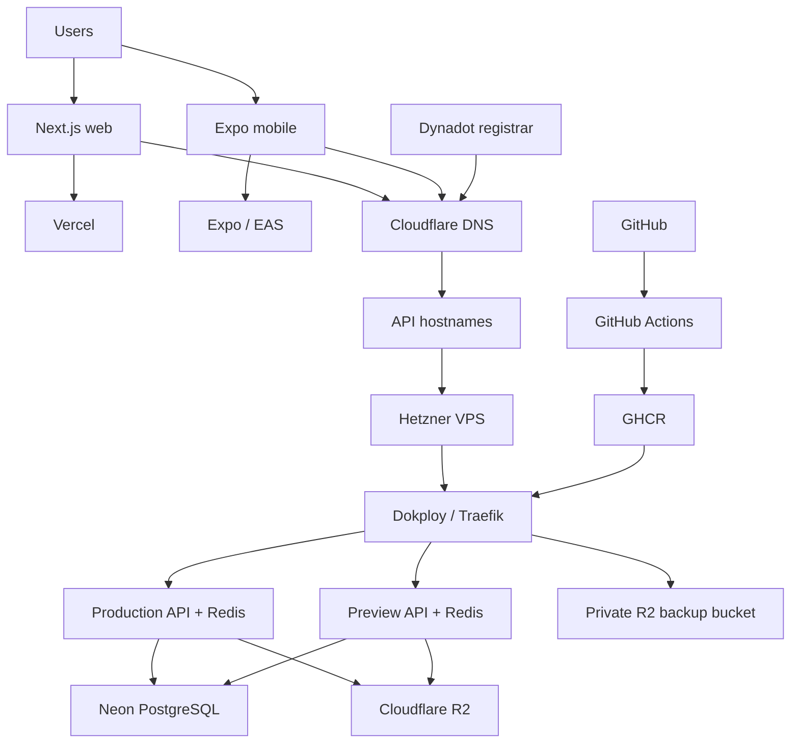

# Salafi Durus Platform Architecture

This is the short platform map. Detailed behavior belongs in the linked domain
documents and operational procedures.

## Platform at a glance



## Applications and packages

```text
apps/api       NestJS API and authority for backend rules
apps/web       Next.js public, account, and editorial client
apps/native    Expo / React Native iOS and Android client
packages/      shared contracts, domain logic, database access, i18n, and UI tokens
```

Applications may depend on packages, but applications must not depend on one
another. The backend owns authorization, business rules, and durable state.

### Web

Vercel hosts `apps/web`. The web client communicates with the API through its
configured API origin. Vercel is not the backend, database, Redis, or image
registry host. Repository-specific build settings are in
[`apps/web/vercel.json`](../apps/web/vercel.json); the operational notes are in
the [Vercel runbook](runbooks/deployment/vercel.md).

### Mobile

`apps/native` is an Expo/React Native listening client. Expo Router owns
routing, feature slices own screens, and local-first state uses persisted
storage plus an outbox. EAS builds and distributes the mobile app using the
`development`, `preview`, and `production` profiles in
[`apps/native/eas.json`](../apps/native/eas.json).

### API, authentication, and administration

The NestJS API is split into interface, application, domain, and infrastructure
layers. Better Auth establishes identity; backend policy checks establish
authorization. Administration uses protected roles and scoped access grants.

See the [API](backend/api.md), [authentication](security/authentication.md),
and [access management](administration/access-management.md) documents.

## Runtime and data

The Preview and Production APIs run as separate Dokploy services on the same
Hetzner VPS. Traefik routes the API hostnames to the correct service. Each API
has its own Redis service; Redis is internal and is never a public dependency.

Neon provides managed PostgreSQL, which is the durable authority for users,
content, publication state, grants, and personal state. Cloudflare R2 stores
application media; PostgreSQL stores object references and metadata, not media
blobs.

```text
Production API → Production Redis
                └→ Neon PostgreSQL
                └→ Cloudflare R2 media

Preview API    → Preview Redis
                └→ Neon PostgreSQL
                └→ Cloudflare R2 media
```

See [database and media](data/database.md) for data ownership and migrations.

## Domains and providers

Dynadot owns the registration for `salafidurus.com`. Cloudflare manages the
authoritative DNS records. They are separate responsibilities.

| Role | Provider |
| --- | --- |
| Web hosting | Vercel |
| Backend compute | Hetzner |
| Backend runtime and deployment | Dokploy and Traefik |
| PostgreSQL | Neon |
| Redis | Dokploy-hosted, environment-specific services |
| Media and Dokploy backups | Cloudflare R2 |
| Source control and CI/CD | GitHub and GitHub Actions |
| Container images | GHCR |
| Mobile builds and releases | Expo / EAS |
| Domain registration | Dynadot |
| DNS | Cloudflare |

Important hostnames, where active, are:

```text
salafidurus.com             Web application
api.salafidurus.com         Production API
preview-api.salafidurus.com Preview API
vps.salafidurus.com         Dokploy management
```

The exact records and proxy settings are managed in Cloudflare and are not
duplicated here.

## Delivery

The backend pipeline builds an immutable image once and promotes that same
artifact:

```text
PR targeting preview
  → build/test ghcr.io/salafidurus/salafi-durus-api:sha-<commit>
  → merge to preview
  → promote existing digest to :preview
  → invoke Preview Dokploy webhook
  → promote the approved digest to :production
  → invoke Production Dokploy webhook
```

Preview and Production use separate GitHub Environments, each exposing the
same secret name, `DOKPLOY_DEPLOY_WEBHOOK`, with a different value. Dokploy
pulls promoted GHCR images; it does not build the application.

Web delivery is handled by Vercel. Mobile delivery is handled by EAS. These
pipelines are separate from the backend image pipeline.

See the [deployment policy](policies/deployment.md).

## Request and environment flows

```text
Browser → Cloudflare DNS → Vercel → Next.js
Web/mobile → API hostname → Cloudflare → Hetzner → Traefik → API
API → Better Auth, Neon, environment Redis, and Cloudflare R2
```

| Area | Development | Preview | Production |
| --- | --- | --- | --- |
| Web | Local | Vercel preview where configured | Vercel production where configured |
| API | Local NestJS | Dokploy Preview API | Dokploy Production API |
| Redis | Local/optional | Preview Redis | Production Redis |
| Mobile | EAS development | EAS preview | EAS production |

The API exposes `/health/healthz` for liveness and `/health` for dependency
health, including database, storage/CDN, and Redis checks where configured.

## Operations and recovery

Dokploy manages backend services, environment values, domains, Traefik,
health checks, deployments, and deployment webhooks. Its control-plane backup
is stored in the private R2 bucket `vps-dokploy-backups`; application media is
a separate R2 concern. Neon and GHCR provide their respective managed data and
artifact recovery capabilities.

If the VPS is lost, the high-level recovery order is:

```text
replacement VPS → fresh Dokploy → restore R2 backup
→ update server IP and DNS → reload Traefik
→ Redis first → verify REDIS_URL → API second → health checks
```

Use the [backup](runbooks/infrastructure/dokploy-backup.md) and
[disaster recovery](runbooks/infrastructure/dokploy-disaster-recovery.md)
runbooks for the exact procedure. Provisioning is documented separately in the
[server provisioning runbook](runbooks/infrastructure/dokploy-server-provisioning.md).

## Security boundaries

- Backend authorization is the security boundary; client checks are UX only.
- SSH uses keys, and Hetzner Cloud Firewalls restrict VPS ingress.
- Dokploy port 3000 is temporary setup access, not normal management access.
- Redis is internal and must not be publicly exposed.
- GHCR, deployment webhooks, runtime secrets, and R2 credentials are protected.
- Preview and Production GitHub Environment secrets remain separate.
- No credentials or webhook URLs belong in the repository.

The Hetzner VPS does not host the web application, primary PostgreSQL, media
storage, GitHub, GHCR, mobile builds, domain registration, or authoritative
DNS.

## Sources of truth

| Concern | Source |
| --- | --- |
| Product intent | [`docs/product/`](product/) |
| Platform map | This document |
| Client architecture | [`docs/clients/`](clients/) |
| API contracts | [`docs/backend/api.md`](backend/api.md) and `@sd/core-contracts` |
| Authentication | [`docs/security/`](security/) and API implementation |
| Database schema | Prisma schema and migrations |
| Web delivery | [`apps/web/vercel.json`](../apps/web/vercel.json) and Vercel |
| Mobile delivery | [`apps/native/eas.json`](../apps/native/eas.json) and EAS |
| CI/CD | [`.github/workflows/`](../.github/workflows/) |
| Images | GHCR |
| Backend runtime | Dokploy and the infrastructure runbooks |
| DNS | Cloudflare |
| Domain ownership | Dynadot |

## Related documentation

- [Product requirements](product/requirements.md)
- [Web](clients/web.md) · [Mobile](clients/mobile.md)
- [API](backend/api.md) · [Authentication](security/authentication.md)
- [Access management](administration/access-management.md)
- [Database and media](data/database.md)
- [Deployment policy](policies/deployment.md)
- [All runbooks](runbooks/README.md)
