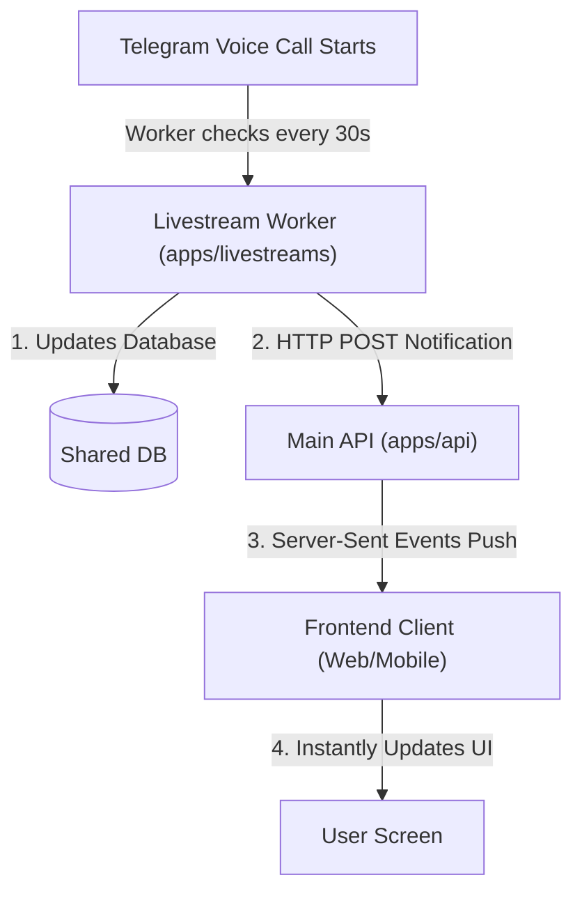

# Design: Real-Time Livestream Push Architecture via Server-Sent Events (SSE)

**Date:** 2026-06-04  
**Branch:** f/realtime-livestreams-push  
**Scope:** `apps/api`, `apps/livestreams`, `packages/core-contracts`, `packages/domain-live`, `apps/web`

---

## Problem

Currently, the client application (`apps/web` and potentially mobile) queries the database periodically (every 20 seconds for active sessions) to fetch the status of livestream sessions. This polling-based architecture has several drawbacks:

- **Resource Inefficiency:** Continuous polling results in redundant database queries and HTTP traffic on the backend.
- **Render Free Tier Limitations:** On Render's Free tier, resources are heavily constrained. High frequency polling from multiple active users can exhaust limits or trigger rate limiters.
- **Lack of Immediacy:** Livestream updates are delayed by up to the poll interval (20 seconds), meaning users do not see live broadcasts instantly.

---

## Proposed Solution

We will transition the livestream architecture to a real-time push model using **Server-Sent Events (SSE)**.

SSE provides a unidirectional stream from the server to clients over standard HTTP. It has native browser support via `EventSource`, automatically handles reconnection, and keeps Render's Free tier containers awake during active client usage since standard HTTP connections are treated as active traffic.

### Process Flow

1. **Detection:** The background worker (`apps/livestreams`) polls Telegram every 30 seconds.
2. **Database Update:** When a status transition is detected, the worker writes the update to the shared database.
3. **Notification Webhook:** Immediately after writing, the worker makes a secure `POST` request to the main API (`apps/api`) at `/live/sessions/sync-notify` sending only the affected session/channel ID.
4. **Broadcast Push:** The main API receives this internal notification, queries the database for the canonical session object, and broadcasts it over the active Server-Sent Events stream (`GET /live/stream`).
5. **UI Update:** The client receives the stream event and updates the TanStack Query cache dynamically.

---

## Detailed Changes

### 1. Backend Core (`apps/api`)

- **Environment & Config:**

  - Add `LIVESTREAM_SECRET` validation via `zod` in `apps/api/src/shared/config/env.ts` (optional with a fallback in development, required in production).
  - Expose `LIVESTREAM_SECRET` in `ConfigService`.

- **Live Service (`LiveService`):**

  - Maintain an RxJS `Subject` to act as the central message bus.
  - Implement `emitSessionUpdate(session: LiveSessionPublicDto)` to push changes to the stream.
  - Call `emitSessionUpdate` during standard DB updates (create/update/status changes).

- **Live Controllers (`LiveController` and `AdminLiveController`):**
  - Implement `GET /live/stream` decorated with `@Sse()` returning the updates stream.
  - Send a heartbeat comment event (`: keep-alive`) every 15 seconds to prevent Render's reverse proxy from closing the connection.
  - Implement `POST /live/sessions/sync-notify` (secured with `Authorization: Bearer <secret>`). This fetches the updated session from the database and calls `emitSessionUpdate()`.

### 2. Livestream Worker (`apps/livestreams`)

- **Config Service:** Expose `API_URL` and `LIVESTREAM_SECRET`.
- **Sessions Service:** Inject the config service and use global `fetch` or HTTP service to send the POST request to the API's `/live/sessions/sync-notify` endpoint when a state transition or viewer count change is detected.

### 3. Contracts (`packages/core-contracts`)

- Define the endpoint path `endpoints.live.stream` and update types if needed.

### 4. Client State & Web App (`packages/domain-live` and `apps/web`)

- Modify `useLiveSection` to subscribe to the SSE stream.
- When an event is received, parse it and update the TanStack Query cache directly using `queryClient.setQueryData`.
- Handle cleanups on unmount.

---

## Verification Plan

### Automated Tests

- Write unit tests in `apps/api/src/modules/live/live.controller.spec.ts` (or similar) to verify:
  - Unauthorized webhook requests are rejected with a `401/403` status.
  - Authorized webhook requests fetch the session and emit updates.

### Manual Verification

1. Run the local dev server: `pnpm dev`.
2. Connect a console script or tool (like Postman) to `http://localhost:3001/live/stream` to listen for events.
3. Trigger the webhook manually using `curl` or Postman.
4. Verify the push event is received instantly.
5. Open `http://localhost:3000/live` on the web app and check if UI changes are applied without page reload.
